# Global Economic Simulation: Technical Report

## Overview

This report provides a detailed explanation of the Global Trade Simulation model, its technical implementation, key assumptions, and how to interpret its results. The simulation models international trade between countries as a network where trade flows are affected by tariffs, political blocs, and comparative advantages in production.

See the deployed version [here](https://tradesimulation.streamlit.app/). I'm hosting for free so the app gets inactive if not used for a while, but if you click the button, it makes the app active again in a few seconds. 

The source code can also be found in the [Github Repo](https://github.com/lifee77/GlobalEconoSim).

## Technical Architecture

The simulation consists of four main components:

1. **Core Data Structures** (`model.py`)
   - Country representation
   - Trade network
   - Simulation engine

2. **Analytics** (`analytics.py`)
   - Mean-Field Approximation (MFA)
   - Parameter sensitivity analysis
   - Metrics calculation

3. **Visualization** (`visualization.py`)
   - Network graphs
   - Time series
   - Comparative charts

4. **UI/Interactive Layer** (`trade_app.py`)
   - Parameter controls
   - Visualization rendering
   - Results presentation

##  Model Primitives

### 1 Country

Each country is modeled as an entity with the following properties:

```python
@dataclass
class Country:
    cid: int                  # Country ID
    bloc: int                 # Political bloc affiliation
    gdp: float                # Gross Domestic Product
    population: int           # Population
    poverty_rate: float       # Percentage of population below poverty line
    dev_index: float          # Development index (0-1 scale)
    eff: Dict[str, float]     # Efficiency/productivity for goods A and B
    exports: float = 0.0      # Total exports
    imports: float = 0.0      # Total imports
    history: Dict[str, List[float]] = field(default_factory=lambda: {...})  # Time series data
```

Countries track their own economic indicators over time, allowing for time-series analysis of their development trajectory.

### 2 Trade Network

The trade network is implemented as a directed graph where:
- Nodes represent countries
- Edges represent trade relationships
- Edge weights include tariffs and distances

```python
class TradeNetwork:
    def __init__(self, countries, conn_intra, conn_inter, tariff_intra_mu, tariff_inter_mu, tariff_sd):
        self.countries = {c.cid: c for c in countries}
        self.G = nx.DiGraph()
        # ... network initialization ...
```

Key network initialization parameters:
- `conn_intra`: Probability of forming trade links within the same bloc
- `conn_inter`: Probability of forming trade links between different blocs
- `tariff_intra_mu`: Mean tariff rate for intra-bloc trade
- `tariff_inter_mu`: Mean tariff rate for inter-bloc trade
- `tariff_sd`: Standard deviation of tariff rates (randomness)

##  Simulation Engine

### 1 Initialization

The simulation is initialized by:
1. Creating `n` countries with random initial attributes
2. Assigning countries to political blocs (or no bloc at all)
3. Establishing trade links based on connection probabilities
4. Setting initial tariff rates based on bloc membership

### 2 Trade Flow Computation

For each time step, trade flows are computed using a modified gravity model:

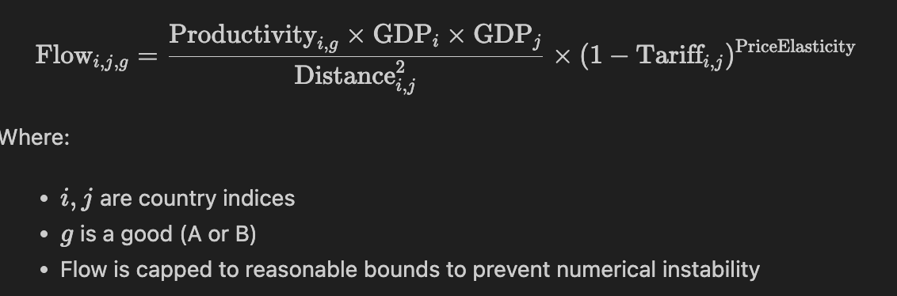
```python
def compute_trade_flows(self, goods: List[str], price_elast: float = 1.0):
    for u, v, data in self.G.edges(data=True):
        c_u, c_v = self.countries[u], self.countries[v]
        tariff, dist = data["tariff"], data["dist"]
        total_flow = 0.0
        for g in goods:
            prod = c_u.eff[g]
            # Scale down GDP values to prevent overflow
            gdp_u_scaled = c_u.gdp / 1e6
            gdp_v_scaled = c_v.gdp / 1e6
            flow = np.clip((prod * gdp_u_scaled * gdp_v_scaled) / (dist ** 2), 0, 1e12)
            flow *= (1 - tariff) ** price_elast
            # ... bounds checking ...
            total_flow += flow
        data["flow"] = total_flow
```

This gravity model is consistent with empirical observations that trade volume:
- Increases with the economic size of trading partners
- Decreases with distance
- Is affected by trade barriers (tariffs)

### 3 Economic Growth Calculation

Each country's GDP growth is computed based on:
1. A base growth rate
2. Trade balance effects

```python
# Calculate trade balance with safeguards
trade_balance = 0.3 * exports - 0.2 * imports

# Limit GDP growth to prevent exponential explosion
# Use tanh to limit growth between -0.3 and +0.3
raw_growth = trade_balance / max(c.gdp, 1e3)
bounded_growth = 0.02 + 0.3 * np.tanh(raw_growth)  # Base growth + bounded trade effect

# Apply GDP growth with safety checks
c.gdp = min(c.gdp * (1 + bounded_growth), 1e15)  # Cap GDP at reasonable maximum
```

# Key assumptions:
- Base growth rate of 2% (0.02). This is considered normal growth too. [(Corporate Finance Institute, n.d.)](https://corporatefinanceinstitute.com/resources/economics/economic-growth-rate/#:~:text=For%20a%20developed%20economy%2C%20an,which%20leads%20to%20increased%20spending.)
- Exports contribute positively to growth (multiplier: 0.3)
- Imports have a smaller negative effect (multiplier: 0.2)
- Growth is bounded by a hyperbolic tangent function to ensure stability
- Hard caps prevent unrealistic values
- My initial assumption for **one step** in the simulation was a day, but that's not realistic as diplomatic processes take much longer. Realistically each step should be **1 week**.

# All other Assumptions

Where there are many economic theories that this simulation is based off of. These are a few of them that are applied. See notes for where these assumptions are simplified/redundant.

## A. Comparative Advantage 

- **Ricardo's Principle**: Each country has a comparative advantage in at least one good, as per Ricardian trade theory. This principle does not apply in the simulation as we have a two goods world with more than 2 countries.
- **Productivity Heterogeneity**: Countries draw random productivity values for goods A and B, creating natural comparative advantages.

## B. Trade Regimes and Tariffs

- **Tariff Continuum**: Countries exist on a spectrum from autarky (no trade) to free trade, represented by tariff values from 0 (free) to 1 (prohibitive). In real life we barely have any country with either of them. North Korea might be an extreme example but they still do have trade with China and Russia (and some assistance from South Korea).
- **Political Blocs**: The simulation models preferential trade agreements through lower intra-bloc tariffs. This aggregates two things that occur in real life
    - Trade agreements like [North American Trade Agreement](https://ustr.gov/trade-agreements/free-trade-agreements/united-states-mexico-canada-agreement) or the [EU zone] (https://policy.trade.ec.europa.eu/eu-trade-relationships-country-and-region/negotiations-and-agreements_en).
    - Friendships & Neighboring Status: Neighboring countries and allies even without special blocs are more likely to trade with each other.
- **Reciprocal Tariffs**: Higher tariffs from country A to B increase the probability of retaliatory tariffs from B to A, as seen in real-world trade wars. A major thing that I **ignored** here is the rade flow between the countries. Ideally if country B buys 90% of country A's goods, they would not like to go on a trade war. However, each othe treat each other the same in terms of recrprocal tarrif. And the reciprocal tarrifs are lower than original as the initial tarrif has already done economic damage to both countries.
- **Tariff Incidence**: The price elasticity parameter determines how tariffs affect trade flows, reflecting burden-sharing between producers and consumers.

## C. Transaction Costs

- **Distance Effect**: Trade flows follow a gravity model pattern: proportional to GDP and inversely proportional to squared distance.
- **Transport Modes**: While not explicitly modeled, the distance parameter implicitly captures the higher costs of trade for distant countries.
- **Landlocked Disadvantage**: Not directly modeled but implied by the distance parameter (could be extended to add specific landlocked penalties).

## D. Network Structure

- **Initial Connectivity**: Trade links form probabilistically, with higher chances within political blocs.
- **Trade Flow Evolution**: Links strengthen or weaken over time based on tariffs and economic growth.
- **Network Effects**: The model captures cascade effects where policy changes in one country affect the entire network.

## E. Economic Growth Dynamics

- **Trade-Driven Growth**: GDP growth is partially determined by trade balance, reflecting export-led growth theories.
- **Poverty Reduction**: Growth reduces poverty rates, following empirical evidence that trade openness tends to reduce poverty. This is based on the fact that employment increases and the cost of goods and services decreases. But, it's not guranteed that poverty decreases, specially when automation kicks in.
- **Increasing Returns**: While not explicitly modeled, the positive feedback between trade and growth captures elements of Krugman's increasing returns theory.

## F. Mean-Field Approximation (MFA)

- **Uniform Interaction**: The MFA replaces specific bilateral relationships with average interactions.
- **Non-Linear Divergence**: We assume that network effects create structural divergences from mean-field predictions.
- **Sigmoid Function**: The MFA model uses an S-shaped curve to relate aggregate variables, reflecting common economic transitions.

## G. Simplifications and Limitations

- **No Exchange Rates**: The model assumes a single global currency for simplicity.
- **No Resource Constraints**: The model ignores natural resource endowments that impact real-world trade patterns.
- **No Political Disruptions**: Wars, sanctions, and other political events are not entirely modeled. A country can have policy shocks (tarrifs or subsidy) but that applies to all other cuntries. 
- **No Dynamic Comparative Advantage**: We do not model the evolution of national capabilities over time.
- **No Capital Flows**: The model focuses on trade in goods.
- **Migrations** : The model also does not account for migration of both skilled laborers. 
- **Subsidy**: Tarrifs often come with subsidy to enhance local manufacturing or services. I have ignored that as we do not know the country's budget. But also, such processes take years and the simulation runs abrely for days.


## H. Welfare Implications

- **GDP Benefits**: The model assumes that, in general, more trade leads to higher GDP.
- **Distributional Effects**: The Gini coefficient tracks how trade patterns affect inequality **between** countries. Unfortunately,  We cannot account for vertical and horizontal inequality within a country in this Model.
- **Deadweight Loss**: Higher tariffs reduce total world GDP, reflecting deadweight losses from trade barriers.

### 4 Policy Shocks

The simulation allows for policy shocks, particularly changes in tariff rates:

```python
def apply_tariff_delta(self, cid: int, delta: float):
    # Apply tariff to all outgoing edges from the country
    for _, v, d in self.G.out_edges(cid, data=True):
        old_tariff = d["tariff"]
        d["tariff"] = np.clip(old_tariff + delta, 0, 1)
        # Mark edge as being under a reciprocal tariff regime
        d["reciprocal"] = True
        
        # ... update diplomatic relations ...
        
        # Add reciprocal tariffs from other countries
        # Other countries will respond with a partial reciprocal tariff (70% of original)
        if self.G.has_edge(v, cid):
            recip_edge = self.G[v][cid]
            old_recip_tariff = recip_edge["tariff"]
            recip_delta = delta * 0.7  # 70% reciprocal response
            recip_edge["tariff"] = np.clip(recip_edge["tariff"] + recip_delta, 0, 1)
            recip_edge["reciprocal"] = True
```

Key features:
- Tariff changes apply to all outgoing edges from a country
- Other countries respond with a 70% reciprocal tariff change
- All tariff values are bounded between 0 and 1
- Diplomatic relations are updated based on tariff changes

### 5 Political Bloc Formation

The simulation models the dynamic formation of political blocs based on trade relations:

```python
def allow_bloc_formation(self, tariff_threshold=0.4):
    """
    Form new blocs in response to high tariffs.
    Countries with low mutual tariffs might form a new bloc.
    """
    # Find pairs of countries with low mutual tariffs
    # ...
    # If both tariffs are below threshold, consider forming a bloc
    if i_to_j_tariff < tariff_threshold and j_to_i_tariff < tariff_threshold:
        avg_tariff = (i_to_j_tariff + j_to_i_tariff) / 2
        potential_bloc_pairs.append((i, j, avg_tariff))
    # ...
    # Apply new bloc assignments
```

Countries with mutually low tariffs may form new blocs, modeling the real-world tendency of countries to form trade agreements and economic unions when trade barriers are low.


## . Interpreting Simulation Results
I'm running the simulation with the following default values:
Countries: 80, Political Blocs: 3, Time Steps: 300 weeks, Intra Bloc link (trade) probability: 0.8, Inter bloc link probability: 0.5, Tarrif gap (between intra and inter): 0.3, Tarrif S.D.: 0.15. I have set tarrif shock (by a special country to 0). ANd this is a two good world.
This results in the follwoing higher order effects.
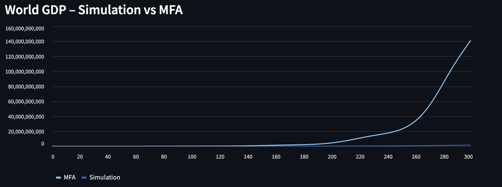
_**Figure 1**World GDP (Y-axis) along with simulation runs (X axis- weeks). Each country has initial GDP, which increases over time as trade continues. GDP = C + I + G + (X - M), where C,I,G,X, and M represent Consuemr spending, investment, government spending, export and import respectively. This is an interactive graph. Please use the [website](https://tradesimulation.streamlit.app/) to see it best._

This result is expected (even in real life) with trade growth as consumers get cheaper goods (countries product the most efficient good). The tarrifs (minimal so far) also increase government budget. Consumer spending and increasing taxes also contribute to higher budget, eventually increasing governemnt spending- which generates employment and increases consumer spending again making a reinforcing cycle. 

### Tarrif Distribution:
The tarrif distribution here is an **emergent property**. There are multiple factors playing a role.

- Distribution for in-bloc countries.
- Distribution for countriesoutside the bloc.
- Reciprocal tarrifs.
The initial mean is 0.1 as countries do have some sort of tarrif to protect vulnerable local industries (In real life tarrifs generally are sectoral, we are just averaging those out here). Before reciprocal tarrifs kick in, this is how the calculation is done:

- tariff_gap = 0.3 → gap/2 = 0.15
- tariff_sd = 0.15

We get;

- intra‑bloc mean = 0.10 − 0.15 = −0.05 → clipped to 0.0
- inter‑bloc mean = 0.10 + 0.15 = 0.25

and each draw is from N(0.0, 0.15) or N(0.25, 0.15), then clipped to [0,1].

The combination of those two Normal distribution and reciprocal tarrif gives a dstribution like this:

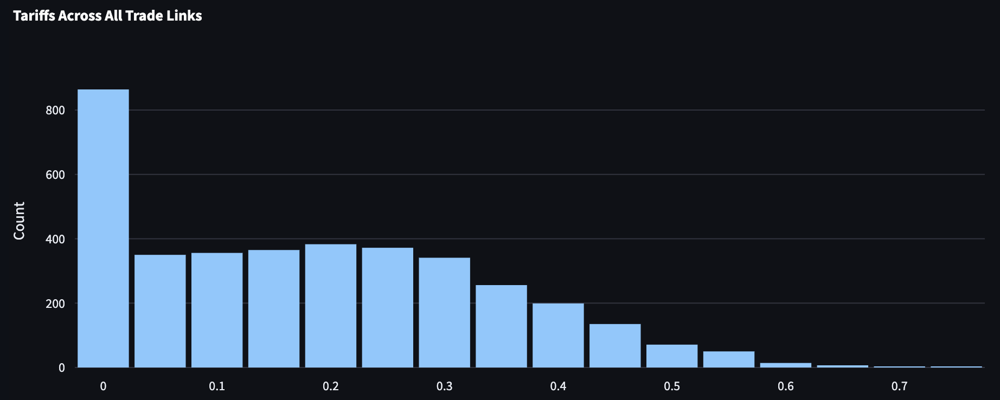

_**Figure 2.** Tarrif distribution in the Simulated Global Economy. The X-axis denotes tarrif value (with 1 being trade-restrictive and 0 being free trade) and the Y axis being trade relations (all the edges in the system combined)._

If we draw these two normal disribution, we would get these graphs;
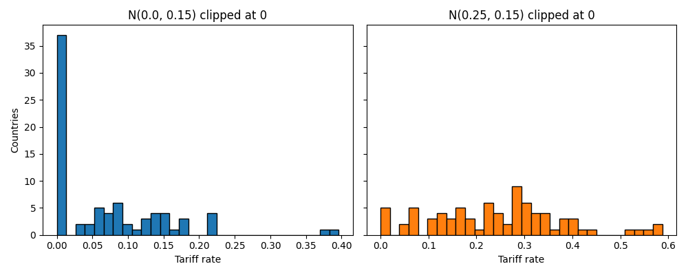

_**Figure 3.** Histogram for Normal Distributions N(0.0, 0.15) in the left and N(0.25, 0.15) in the right. Both histograms are clipped at 0 tarrif assuming countries would not subsidize foreign goods (there are some exceptions in real life; eg: Nepal subsidizes farm equipments). 80 countries are used for both histograms. See plot code [here](https://github.com/lifee77/GlobalEconoSim/blob/main/plots.py)._

These distributions make it clear why so many edges have barely any tarrif (0 is the mode here). I'm ignoring the reciprocal tarrifs, which make this emergent property but the number of blocs and such low initial tarrifs would also lead to low reciprocal tarrifs.


### Trade Flow
Trade flow between two countries is the flow of goods and services. I tried to see if trade flow depends on tarrifs. I got an inverse relation as expected as seen in Figure 4.

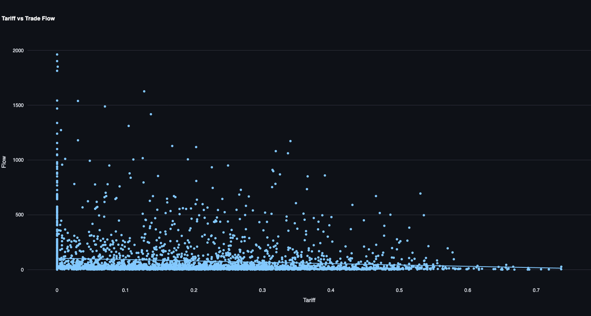

_**Figure 4.** Trade Flow between different countries with differing tarrif values. Trade flow is measured by the exchange of goods (A&B). A line of best fit is drawn._

However, Figure 5 below (obtained when clicked on the graph) shows that R^2 is 0.012, essentially only 1.2% of that variation is described by tarrifs. This is surprisingly lower than what I expected. I see two reasons for this. First, there is no mechanism in the system for reducing tarrifs (even mutually). So, if two countries both set tarrifs at 10%, they would continue to trade unless they find new partners that produc the same good more efficiently, but they already have a higehr tarrif, which would invite retaliation.

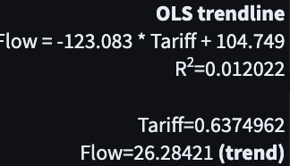

_**Figure 5.** Statistics or the Trendline._

### Poverty:


_**Figure 6. Average Poverty Rate over time.** Each country has a iidividual poverty rate, which decreases with an increase in the growth rate of the country. This is highly simplistic as poverty does not necessarily increase with increase in economic growth. Then we take the average poverty among countries._

```python
growth_effect = np.clip(bounded_growth - 0.01, -0.5, 0.5)  # Limit effect
c.poverty_rate = max(c.poverty_rate * (1 - 0.3 * growth_effect), 0.01)
```

We see that poverty is decreasing overtime as more trade flows, increasing economic growth.

### Gini Coefficient (Inter-country Inequality):

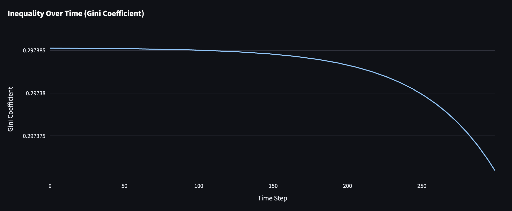
_**Figure 7. Inequality over time.** The graph shows vertical inequality between countries over time._

```python
def gini(x):
    n = len(x)
    if n <= 1:
        return 0
    s = sum(i * x[i] for i in range(n))
    return (2 * s / (n * sum(x)) - (n + 1) / n)
```

The inequality is reducing over time as trade flow increases. This indicates trade benefits all countries. However, there's no evidence that this wealth goes equally within those countries. AT least, we see that trade gives opportunities to poor countries (as a whole) to make more money.

### Network Structure

The trade network visualization shows:
- Node color: Political bloc membership
- Node size: GDP (larger = higher GDP)
- Edge width: Trade flow volume
- Edge style: Solid for normal trade, dashed for reciprocal tariff relationships

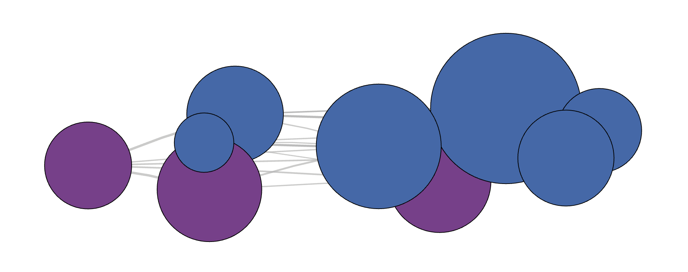
_**Figure 8.** A network diagram showing trade relations between countries. For simplicity, I changed the initial parameters and have shown just 9 countries with 2 political blocs. Nodes are countries and Edges are trade relations. Each edge carries values of trade flow, friendship, tarrif, etc._

It is really hard to see a network diagram with 80 countries where node size increases with GDP. For my simulation, the **edge length remains constant**. This is because I'm trying to simulate real world, where more distance means higher transaction cost. This makes the network graphs ugly. SO, I have added more statistics in the application. Or please review the interactive graph where you can see node and edge parameters by hvering over the graphs.


### Policy Shock Effects

A single country can apply a radically different tarrif policy. Let's see how that plays out in the Global economy. We will compare that with the same values we used above.

Say the country introduces 50% tarrif.


###  Fragmentation Analysis

The simulation measures network fragmentation by removing weak trade links:

```python
# fragmentation: components after pruning weak edges
flows_array = np.array(flows)
threshold = np.percentile(flows_array, 40)  # weakest 40% removed
weak_edges = [(u, v) for u, v, d in G_copy.edges(data=True) if d.get("flow", 0) < threshold]
G_copy.remove_edges_from(weak_edges)
comps = nx.number_weakly_connected_components(G_copy)
```

More components indicate a fragmented world economy. High fragmentation often occurs when tariff gaps between blocs are high, representing a world divided into distinct trading communities.

##  Technical Implementation Details

### 1 Numerical Stability

Several measures ensure numerical stability:
- GDP values are scaled down during flow calculations: `gdp_u_scaled = c_u.gdp / 1e6`
- Growth rates are bounded using hyperbolic tangent: `bounded_growth = 0.02 + 0.3 * np.tanh(raw_growth)`
- Hard caps on values: `c.gdp = min(c.gdp * (1 + bounded_growth), 1e15)`
- Minimum values for poverty rates: `c.poverty_rate = max(c.poverty_rate * (1 - 0.3 * growth_effect), 0.01)`

### 2 Randomness

Random elements include:
- Initial country GDP, population, poverty rates
- Initial productivity for goods A and B
- Trade link formation (probabilistic)
- Initial tariff rates (drawn from normal distribution)

### 3 Performance Considerations

For larger simulations:
- Edge count grows as O(n²) with country count
- Computation time scales approximately as O(n² × steps)
- Memory usage is dominated by the history data structures

##  Parameter Sensitivity Analysis

### How it's implemented.

The simulation includes tools for parameter sensitivity analysis, which helps identify:
- Critical parameter thresholds
- Regions of stability/instability
- Relative importance of different model components

```python
def parameter_sensitivity_analysis(param_name, param_range, fixed_params, target_metric, steps, num_replicates=1):
    """
    Run sensitivity analysis on a parameter by varying it while keeping others fixed.
    Returns a DataFrame with results.
    """
    results = []
    
    for param_value in param_range:
        # Create simulation parameters
        sim_params = fixed_params.copy()
        sim_params[param_name] = param_value
        
        # We'll store results for this parameter value across replicates
        replicate_results = {
            'final_values': [],
            'growth_rates': []
        }
        
        for rep in range(num_replicates):
            # ... run simulation ...
            # ... calculate metrics ...
            replicate_results['final_values'].append(final_value)
            replicate_results['growth_rates'].append(growth_rate)
        
        # Calculate mean and standard deviation across replicates
        final_value_mean = np.mean(replicate_results['final_values'])
        final_value_std = np.std(replicate_results['final_values'])
        
        # ... store results ...
    
    return pd.DataFrame(results)
```

This allows for rigorous testing of how the model responds to different parameters.

The 2nd tab of my Streamlit app does the Parameter Sensitivity Analysis:

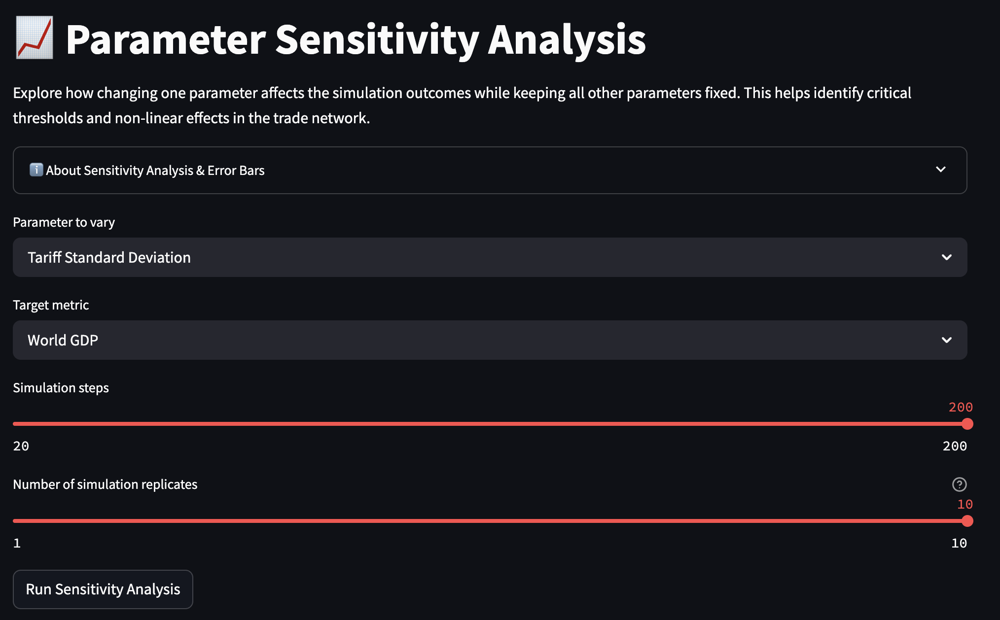

I have added all the parameter and several higher order effects (GDP, poverty rate, trade volume, network fragmentation, and Gini Coefficient). I will only test for global GDP and Network Fragmentation here for the sake of time and word count. I will run each simulation for 200 steps and run 10 simulations t see variability.

Global GDP is simply the sum of GDP of all nations (80 here) in a single currency (the unit doesn't have relevance here but say $ or Rupees).  Network Fragmentation is calculated as follows:
`
undirected_G = G.to_undirected()
components = list(nx.connected_components(undirected_G))
n = G.number_of_nodes()
largest_cc_size = max(len(c) for c in components)

# Fragmentation index ∈ [0,1]:
#   0 = fully connected (all nodes in one component)
#   1 = totally fragmented (no edges at all)
fragmentation = 1.0 - largest_cc_size / n
`
If all components are connected, network fragmentation would be;

`fragmentation = 1.0 - n / n = 0`


### Tarrif S.D & Network Fragmentation

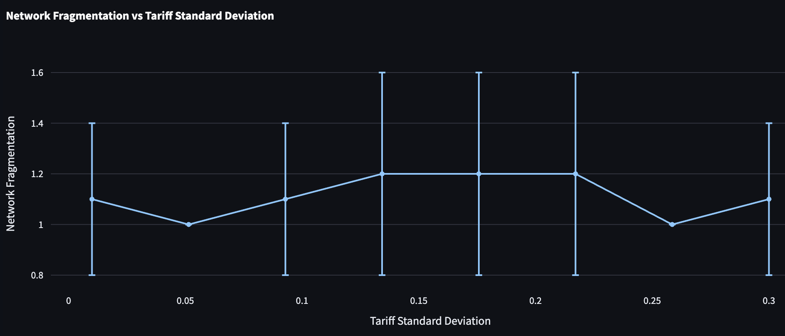

_**Figure 9.** Network Fragmentation with change in Tarrif Standard Deviation. Note that this s.d. is used to calculate the Normal distribution for Tarrifs. I have made those Normal plots above; see Figure 3. Error bars show the standard deviation across multiple simulation runs with identical parameters but different random seeds._

Note My App gives these Calculations by itself:

```
Optimal Tariff Standard Deviation: 0.05 for minimizing Network Fragmentation

Equilibrium Assessment
Average coefficient of variation: 22.73%

❌ High variability between replicates. The system likely does not reach equilibrium with current settings.

Parameter values with high outcome variability:

- Tariff Standard Deviation = 0.01

- Tariff Standard Deviation = 0.09

- Tariff Standard Deviation = 0.13

- Tariff Standard Deviation = 0.18

- Tariff Standard Deviation = 0.22

- Tariff Standard Deviation = 0.30
```

Since, the variation is too high, we wouldn't be too confident that the optimal tarrif s.d. is 0.05. However, this makes sense in a way as all countries would have similar tarrifs so no country is being excluded from global market merely because of tarrif.

### Tarrif S.D & Global GDP:

I would argue that Global GDP and Network fragmentation are correlated. This is followed by a simple argument, as more trade leads to higher GDP (explained above):

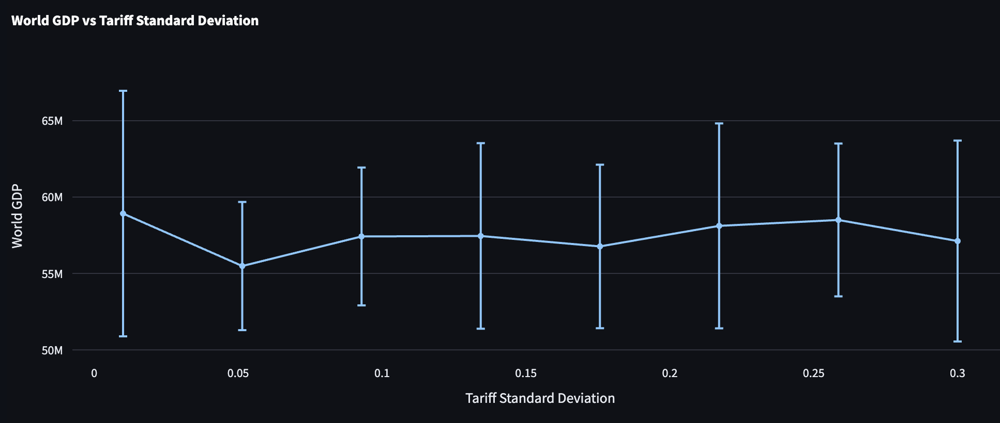

_**Figure 10.** Global GDP with change in Tarrif Standard Deviation. Error bars show the standard deviation across multiple simulation runs with identical parameters but different random seeds._

The graphs do look pretty similar. We have high variability here too, with Average coefficient of variation: 10.08%. This is much lower than the variability with network fragmentation. While there is no clear trend, the optimal value is 0.01, suggesting lower trade increases GDP. See the app for detailed statistics and table.

### Number of Political Blocs vs GDP

Political blocs are interesting as they increase trade between the countries in the bloc but restrict trade outside the bloc. With a inter-tra bloc tarrif difference of 0.3, 15 blocs among 80 countries, we see the following results.

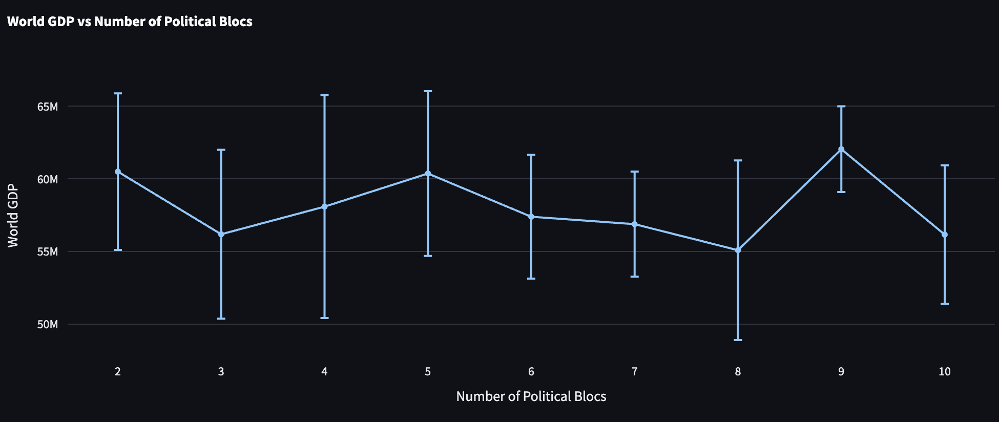

_**Figure 11.** Number of political/economic blocs vs global GDP._

Critical values detected:

• Number of Political Blocs = 3.00 (minimum World GDP: 56184674.10)

• Number of Political Blocs = 5.00 (minimum World GDP: 60362778.61)

• Number of Political Blocs = 8.00 (minimum World GDP: 55086286.92)

• Number of Political Blocs = 9.00 (maximum World GDP: 62035667.05)


Optimal Number of Political Blocs: 9.00 for maximizing World GDP

Note that here, Average coefficient of variation is 8.90%. Increasing simulation runs would help (Too late into the assignment to change the UI now).

However, it seems somewhat counter intuitive given that free trade should increase GDP. Perhaps the increased trade within blocs (as there are only two goods and you don't necessarily need 80 countries for them) might have contributed to that. And honestly, the difference is not that high (55 million - 62 million). I wonder, if it would be the same if I had 80 different goods, I would say no, but that would be an interesting experiment. (If I can get a post assignment 5 for that, I would love to do that even after submission, that's just a joke.)

### Intra Bloc Connectivity vs GDP


## Mean-Field Approximation (MFA)


The Mean-Field Approximation (MFA) simplifies complex interaction systems by replacing all pairwise interactions with an average "field." In our trade simulation:

- The full network simulation tracks individual trade links between specific countries
- The MFA treats each country as trading with an "average world economy"

This allows us to evaluate the importance of network structure by comparing the fully heterogeneous model with its homogeneous approximation.

### MFA Implementation

```python
def mfa_series(network, steps):
    """
    Generate a Mean Field Approximation time series for comparison with full network sim.
    MFA ignores network structure and treats every country as interacting with the 'average' country.
    """
    # Get initial values
    countries = list(network.countries.values())
    
    # Start with the first value from the actual simulation
    world_gdp_t0 = sum(c.history["gdp"][0] for c in countries)
    mfa_series = [world_gdp_t0]
    
    # Simple growth model for MFA - baseline growth plus trade effect
    for t in range(1, steps):
        # Fixed parameters for MFA growth model
        base_growth = 0.02  # 2% base growth
        trade_impact = 0.03  # Trade adds up to 3% extra growth
        
        # World GDP grows by baseline growth rate
        mfa_growth = base_growth + trade_impact * (0.5 + 0.5 * np.sin(t/10))  # Add cyclical component
        world_gdp = mfa_series[-1] * (1 + mfa_growth)
        mfa_series.append(world_gdp)
    
    return mfa_series
```

Key MFA assumptions:
- Base growth rate of 2%
- Trade adds up to 3% additional growth
- A cyclical component simulates business cycles
- No heterogeneity in tariffs or political blocs
- No network effects

### MFA vs. Full Simulation

The MFA differs from the full simulation in several key ways:

| Feature | Full Simulation | MFA |
|---------|----------------|-----|
| Trade connections | Heterogeneous, based on blocs | Homogeneous, all countries connected equally |
| Tariffs | Vary by country pair and bloc membership | Implicit in average growth rate |
| Shocks | Propagate through network with ripple effects | Affect overall growth directly |
| Comparative advantage | Modeled explicitly through productivity differences | Not modeled |
| Inequality | Emerges from network structure | Not captured |

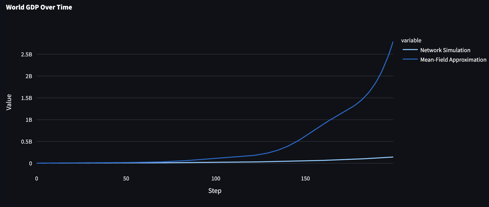
_**Figure 12.** MFA vs Simulation results for Global GDP. Final divergence between simulation and MFA: 94.9%_

Here, the MFA does not predict GDPs as we only care about individual country's growth over time (with constant 3% annual growth). While, network effects grow the country much slower. 

Similarly, MFA predicts that poverty reduces much faster than simulation reesults as seen in Figure 13. It is to note, that MFA still predicts the direction. Hence, it is still valueble to some extent.

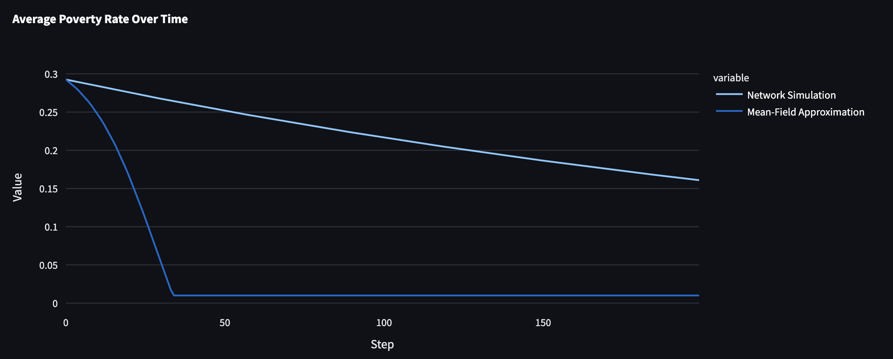
_**Figure 12.** MFA vs Simulation results for Poverty rate._


## Conclusion

The Global Trade Simulation shows the effects of tarrif in the world economy. It shows that political blocs and comparative advantages fundamentally shape macro‑economic outcomes in ways that an aggregate model (MFA) cannot capture. By tracking bilateral flows, shocks and growth at the country level, we observe how network connectivity amplifies both opportunities and vulnerabilities, producing heterogeneous trajectories of GDP, poverty and inequality. The comparison with a Mean‑Field Approximation highlights the critical role of heterogeneity: while MFA can reproduce broad trends, it underestimates divergence, fragility and spill‑over effects that emerge naturally in a networked system. Our modular, transparent framework thus offers a powerful “what‑if” laboratory for policymakers and researchers to explore the trade‑off between openness and fragmentation, and to design interventions that balance growth, equity and resilience in the global economy.


# Appendix:
See all of my Code here too: https://github.com/lifee77/GlobalEconoSim

## HCs:
I have tagged a few HCs for transfer reasons but not necessarily all LOs and HCs used.

### #networks:
Given the feedback in first assignmnet, I have added graphs with error bars for sensitivity analysis. Also all of my graphs are interactive.

### #audience:
This app is supposed to be for SS111 students, who are not necessarily CS majors and would require a simple UI. Hence, I made an app instead of a notebook and the app also generates interpretations based on results. I also have several other tables that are not in this report generated. I have also described what each parameter means (they can toggle the `i` button for that.)

### #modeling:
I think the primary emphasis is to show how I have based this on economic theories and basis understanding. I have also stated how I hav diverged from those for simplification. I acknowledge that global trade is very complex and I might have missed a few more phenomenons.

### #emergentproperties:
I have talked about several higher order effects (GDP, poverty, etc) and then tried to estimate those with both MFA and simulation. For some special cases, we get that near a linear result (as I discussed for tarrif distribution), but we discussed in class that it doesn't necessarily make it non-emergent. For most cases, it's still unprediictable as seen by the difference in MFA and simulation. I again acknowledge that it is possible to get the resuts of the simulation theoretically as this is a highly simplified model, but with today's computers, we would not be able to predict those higher order effects. If we could, peoplewould be rich off of the current tarrifs in the US and the market would not be swinging up and down.